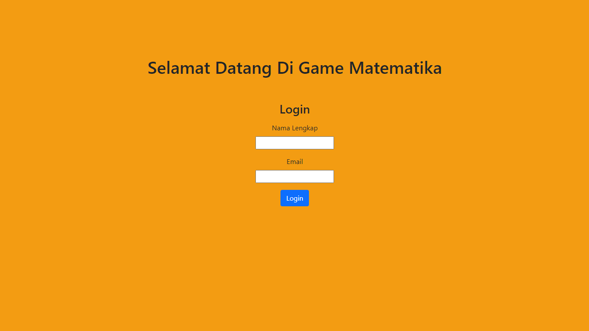

# UTS PEMROGRAMAN WEB - GAME MATEMATIKA
## Kharisma Adinda Putri Vidiasari K3519047

Pada project kali ini, dibuat web game matematika sederhana. Pada tampilan awal game, diberikan form untuk login menggunakan nama dan email. setelah memasukkan nama dan email, maka akan ditampilkan rules dan tombol mulai game. Jika username tidak benar, maka dapat klik link bukan anda untuk logout. Setelah mengklik mulai game, maka akan merandom 2 angka dan mengatur session untuk lives menjadi 5 dan score 0. Seperti pada rules yang sudah dijelaskan di tampilan setelah login, setiap jawaban benar akan mendapatkan score 10. Jika jawaban salah, maka score akan berkurang 2 dan lives berkurang 1. Tampilan lives digambarkan dengan bentuk hati di pojok kiri atas, bersebelahan dengan score dan tombol logout. Ketika lives sudah mencapai 0, maka akan muncul Game Over dan tampilan tabel ranking 10 teratas. Pemain dapat memulai kembali game.

 

# **Tampilan Awal Website**

# **Tampilan Website Setelah Login + Rules**

# **Tampilan Awal Game

# **Tampilan Ketika Menjawab Dengan Salah**

# **Tampilan Ketika Menjawab Dengan Benar**

# **Tampilan Ketika Nyawa Sudah Mencapai 0 dan Tabel Ranking 10 teratas**

 

## Link Website : http://kharismaapv.epizy.com/index.php
